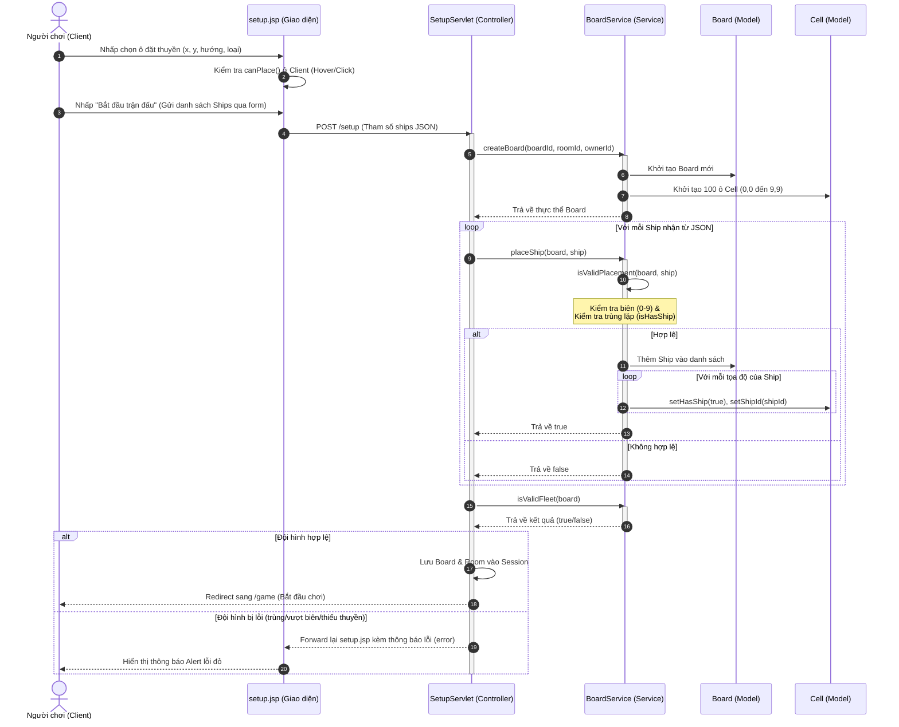
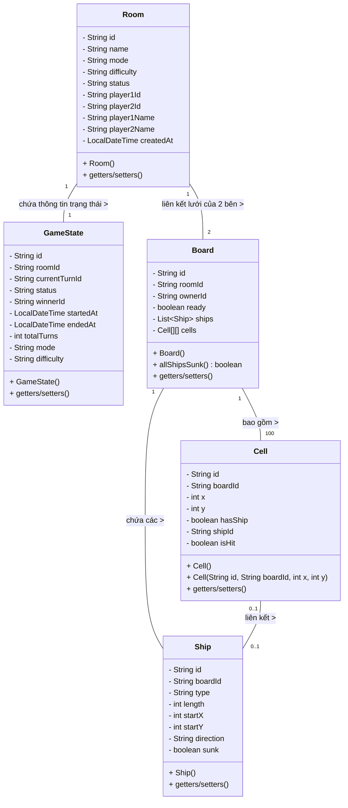

# Tài liệu Thiết kế Kỹ thuật - Thiết lập trận đấu (Match Setup)

Tài liệu này mô tả chi tiết thiết kế hệ thống cho các chức năng thuộc phạm vi của **Thành viên B**:
- **UC04**: Tạo phòng / chọn chế độ chơi
- **UC05**: Đặt thuyền (Manual & Auto)

---

## 1. Yêu cầu Nghiệp vụ (Business Requirements - BR)

### Mục tiêu
Cung cấp cho người chơi một quy trình thiết lập trận đấu hoàn chỉnh trước khi bắt đầu chơi. Người chơi có thể cấu hình phòng chơi, chọn đối thủ (chơi với AI hoặc chơi PvP offline luân phiên), thiết lập độ khó của AI (nếu chọn chơi với AI) và bố trí đội hình thuyền trên lưới kích thước 10x10.

### Quy trình nghiệp vụ chính:
1. **Tạo phòng & Chọn chế độ (UC04)**:
   - Hệ thống khởi tạo một phòng chơi (`Room`) mới với ID duy nhất.
   - Người chơi chọn chế độ:
     - **PvE (Chơi với AI)**: Có thể cấu hình thêm độ khó cho AI (**Easy** hoặc **Hard**).
     - **PvP (Chơi 2 người)**: Người chơi nhập thêm tên của Người chơi 2 (mặc định là "Người chơi 2").
2. **Đặt thuyền (UC05)**:
   - Đội hình tiêu chuẩn gồm **5 thuyền** với kích thước cố định:
     - **Carrier**: độ dài 5 ô.
     - **Battleship**: độ dài 4 ô.
     - **Cruiser**: độ dài 3 ô.
     - **Submarine**: độ dài 3 ô.
     - **Destroyer**: độ dài 2 ô.
   - **Đặt thuyền Thủ công (Manual Placement)**:
     - Người chơi chọn một thuyền từ danh sách chưa đặt, chọn hướng xoay (Ngang - Horizontal / Dọc - Vertical).
     - Người chơi nhấp vào lưới để đặt thuyền. Hệ thống hiển thị xem trước (Hover Highlight) màu xanh nếu hợp lệ, màu đỏ nếu không hợp lệ.
     - Ràng buộc: Thuyền đặt phải hoàn toàn nằm trong lưới (0-9), không chồng lấn lên các thuyền đã đặt trước đó.
   - **Đặt thuyền Tự động (Auto Placement)**:
     - Người chơi nhấp "Tự động đặt". Hệ thống tự sinh ngẫu nhiên tọa độ và hướng đặt hợp lệ cho cả 5 thuyền sao cho không bao giờ có sự chồng lấn hay vượt biên.
3. **Hoàn tất**:
   - Khi cả 5 thuyền đã đặt hợp lệ, nút "Bắt đầu trận đấu" được kích hoạt để khởi tạo game và chuyển hướng sang màn hình chơi game (`game.jsp`).

---

## 2. Sơ đồ Use Case (Use Case Diagram)

Dưới đây là sơ đồ Use Case thể hiện mối quan hệ giữa Actor (Player) và các chức năng tạo phòng, đặt thuyền:

```mermaid
usecaseDiagram
    actor Player as "Người chơi"
    
    usecase UC04 as "UC04: Thiết lập trận đấu
    (Tạo phòng / Chọn chế độ)"
    usecase UC05_Manual as "UC05: Đặt thuyền thủ công
    (Click đặt ô)"
    usecase UC05_Auto as "UC05: Đặt thuyền tự động
    (Auto Place)"

    Player --> UC04
    Player --> UC05_Manual
    Player --> UC05_Auto
```

---

## 3. Sơ đồ Tuần tự (Sequence Diagram - UC05 Thủ công)

Sơ đồ tuần tự dưới đây thể hiện luồng xử lý khi người chơi nhấp chuột đặt thuyền thủ công từ giao diện, truyền dữ liệu JSON qua `SetupServlet` và được xác thực qua các Service và Model ở phía Server:



---

## 4. Sơ đồ Lớp chung toàn nhóm (Class Diagram)

Đây là sơ đồ lớp chung chứa toàn bộ các Model cốt lõi (`Cell`, `Ship`, `Board`, `Room`, `GameState`), được thiết lập bởi Thành viên B để cả nhóm sử dụng thống nhất:


